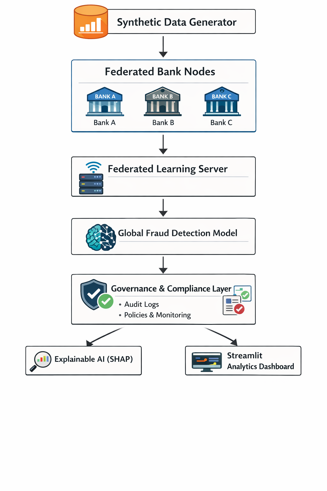
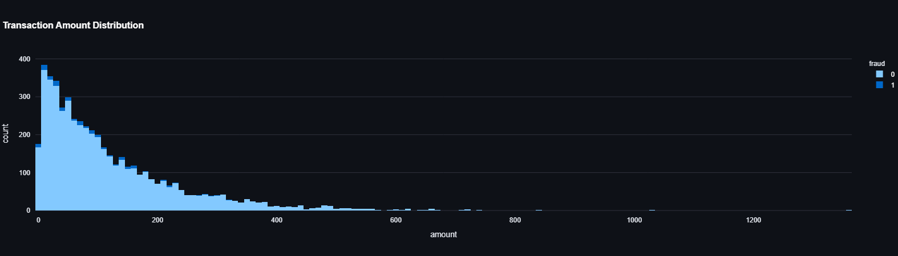
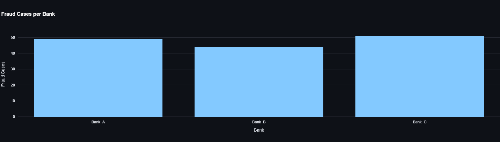
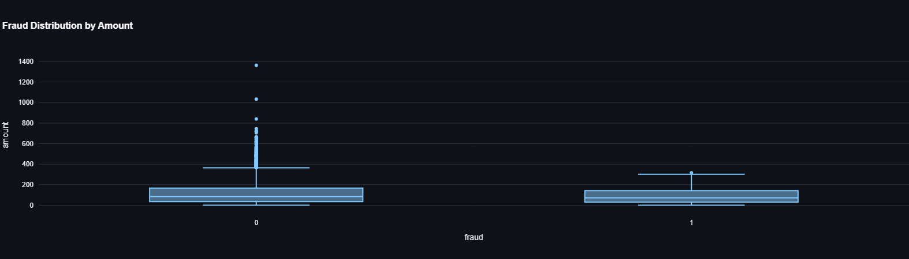
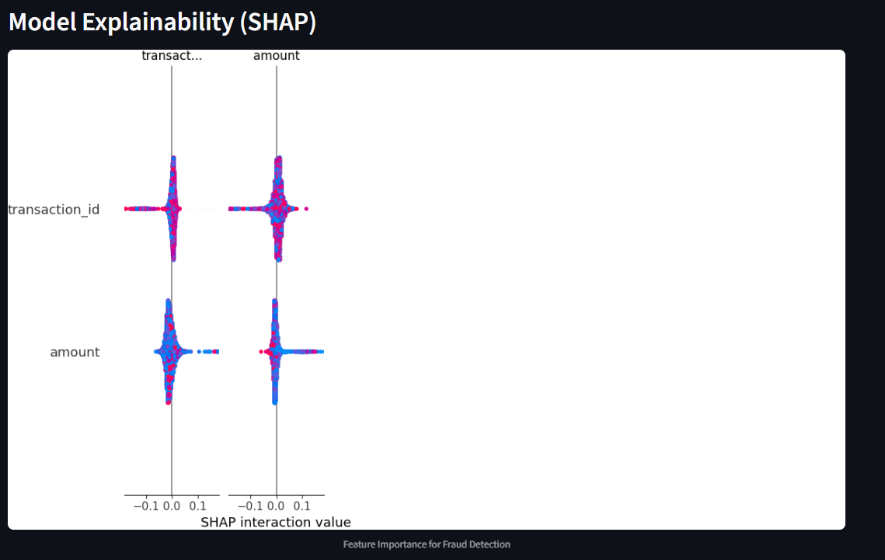
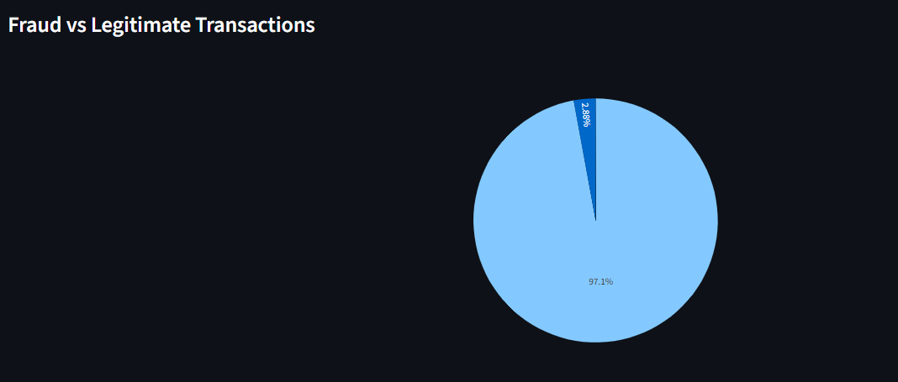

# Federated Financial Forecasting AI Platform

An end-to-end **FinTech AI system** that detects fraudulent transactions using **federated learning, multi-agent simulation, synthetic data generation, governance auditing, and explainable AI**.

The system demonstrates how multiple financial institutions can collaboratively train fraud detection models **without sharing sensitive customer data**.

https://federated-fraud-detection-ai.streamlit.app/
---

## 🚀 Key Features

* **Synthetic Financial Data Generation** using GAN-based models
* **Multi-Agent Banking Simulation** representing independent financial institutions
* **Federated Learning Model Training** with Flower framework
* **AI Governance & Audit Layer** with SQLite logging
* **Explainable AI (SHAP)** for fraud prediction transparency
* **Interactive Analytics Dashboard** built with Streamlit
* **FinTech-style analytics interface** with charts and KPI monitoring

---

## 🏦 System Architecture

```text
Synthetic Data Generator
        │
        ▼
Multi-Agent Banks (Ray)
        │
        ▼
Federated Learning Server (Flower)
        │
        ▼
Global Fraud Detection Model
        │
        ▼
Governance Layer
   ├─ Audit Logging
   ├─ Policy Engine
   └─ Compliance Monitoring
        │
        ▼
Explainable AI (SHAP)
        │
        ▼
Streamlit Analytics Dashboard

```


---

## 📊 Dashboard Capabilities

The Streamlit dashboard provides a **real-time analytics interface** similar to financial risk monitoring platforms.

### Features

* Transaction analytics & fraud statistics
* Fraud distribution and transaction patterns
* Bank-level agent activity monitoring
* Federated learning status tracking
* Governance audit logs
* SHAP explainability visualizations

---

## Dashboard Preview







---

## 🧠 Technologies Used

| Category           | Tools                 |
| ------------------ | --------------------- |
| Data Processing    | Pandas, NumPy         |
| Synthetic Data     | SDV, CTGAN            |
| Machine Learning   | Scikit-learn, PyTorch |
| Federated Learning | Flower                |
| Multi-Agent System | Ray                   |
| Explainable AI     | SHAP                  |
| Dashboard          | Streamlit, Plotly     |
| Database           | SQLite                |
| Visualization      | Matplotlib            |

---

## 📂 Project Structure

```text
federated-fraud-detection-ai
│
├── agents/
│      bank_agents.py
│
├── federated_learning/
│      fl_server.py
│      fl_client.py
│
├── synthetic_data/
│      generate_data.py
│      transactions.csv
│
├── governance/
│      audit.py
│      policy.py
│      explain.py
│
├── ui/
│      app.py
│
├── requirements.txt
└── README.md
```

---

## ⚙️ Installation

Clone the repository:

```bash
git clone https://github.com/yourusername/federated-fraud-detection-ai.git
cd federated-fraud-detection-ai
```

Create a virtual environment:

```bash
python -m venv venv
```

Activate it:

**Windows**

```bash
venv\Scripts\activate
```

**Mac/Linux**

```bash
source venv/bin/activate
```

Install dependencies:

```bash
pip install -r requirements.txt
```

---

## ▶️ Running the System

### 1️⃣ Generate Synthetic Transactions

```bash
python synthetic_data/generate_data.py
```

### 2️⃣ Run Federated Learning Server

```bash
python federated_learning/fl_server.py
```

### 3️⃣ Start Federated Clients

```bash
python federated_learning/fl_client.py
```

### 4️⃣ Generate Explainability Chart

```bash
python governance/explain.py
```

### 5️⃣ Launch Dashboard

```bash
streamlit run ui/app.py
```

---

## 🌐 Deployment

The dashboard can be deployed using **Streamlit Cloud**.

Steps:

1. Push the repository to GitHub
2. Open Streamlit Cloud
3. Create a new app
4. Select:

```
Repository: federated-fraud-detection-ai
Branch: main
File: ui/app.py
```

---

## 📈 Example Use Cases

* Financial fraud monitoring systems
* Banking risk analytics platforms
* Privacy-preserving collaborative AI
* Regulatory AI governance demonstrations
* FinTech AI portfolio projects

---

## 🔐 Why Federated Learning?

Traditional machine learning requires centralized data collection.
Federated learning enables **collaborative model training without sharing raw data**, preserving privacy and regulatory compliance.

Benefits:

* Data privacy protection
* Cross-institution model improvement
* Regulatory compliance
* Reduced data-sharing risk

---

## 🧑‍💻 Author

Developed as an **AI FinTech architecture project** demonstrating federated fraud detection and explainable AI.

---

## ⭐ Future Improvements

* Real-time transaction streaming
* Model performance tracking
* Kubernetes deployment
* Bank-level federated aggregation
* Advanced anomaly detection models

---
